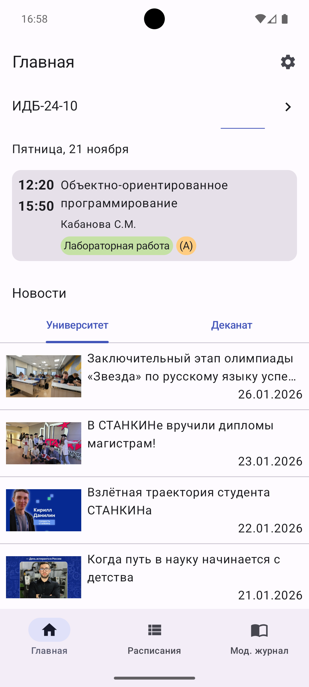
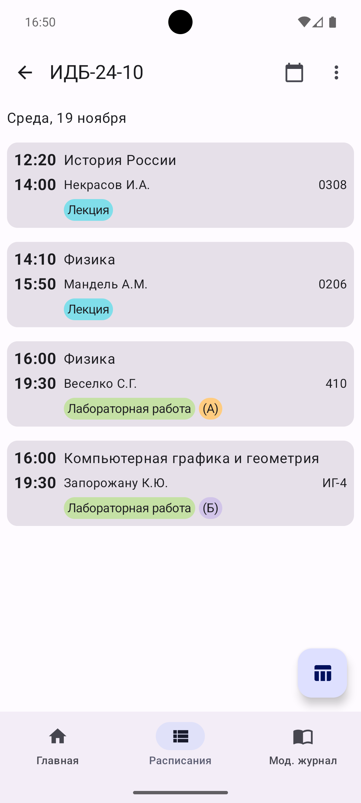
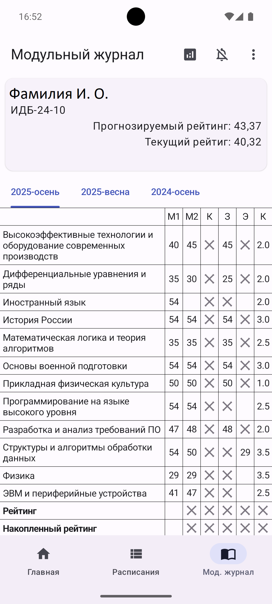
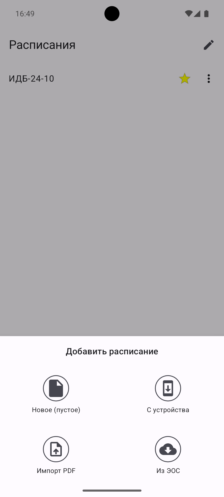
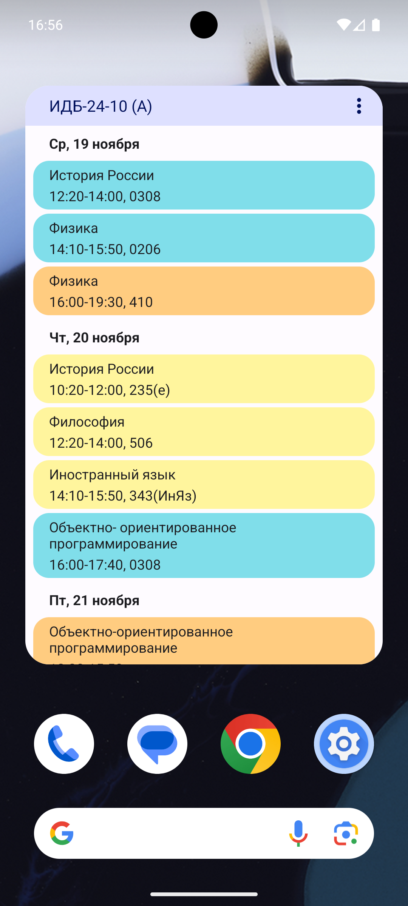

<div align="center">

# СТАНКИН Расписание

**Неофициальное приложение для студентов МГТУ «СТАНКИН»**

[](https://github.com/overklassniy/STANKIN_Schedule_app/releases/latest)
[](https://www.android.com/)
[](https://kotlinlang.org/)
\


[🇷🇺 Русский](README.md) • [🇺🇸 English](README_en.md)

</div>

---

## О проекте

**СТАНКИН Расписание** – это неофициальное мобильное приложение для студентов МГТУ «СТАНКИН», которое предоставляет удобный доступ к расписанию занятий, модульному журналу и новостям университета прямо с вашего смартфона.

Этот проект является форком [ProjectPepega](https://github.com/Nikololoshka/ProjectPepega) – оригинального приложения, которое больше не поддерживается автором. Проект был возобновлен и продолжает развиваться с улучшениями и новыми функциями.

### Основные возможности

- **Расписание занятий** – просмотр расписания с удобной навигацией по дням
- **Модульный журнал** – доступ к оценкам и рейтингу
- **Новости университета** – свежие новости прямо в приложении
- **Виджет на рабочем столе** – быстрый доступ к расписанию без открытия приложения
- **Темная тема** – комфортная работа в любое время суток
- **Импорт расписаний** – поддержка импорта из различных источников, включая Электронную Образовательную Среду (ЭОС) МГТУ «СТАНКИН»

## Скачать

<div align="center">

[](https://www.rustore.ru/catalog/app/com.overklassniy.stankinschedule)
[](https://github.com/overklassniy/STANKIN_Schedule_app/releases/latest)

</div>

---

## Скриншоты

<div align="center">

| Главная | Расписание | Журнал |
|:---:|:---:|:---:|
|  |  |  |

| Списки расписаний | Виджет |
|:---:|:---:|
|  |  |

</div>

---

## Технологии

Приложение построено на современных технологиях Android-разработки:

- **Kotlin 2.3.0** – современный язык программирования
- **Jetpack Compose** – декларативный UI-фреймворк
- **Material Design 3** – современный дизайн-язык
- **Hilt** – dependency injection
- **Room** – локальная база данных
- **Retrofit** – работа с сетевыми запросами
- **Firebase** – аналитика и crash reporting
- **Coroutines** – асинхронное программирование

## Разработка

### Требования

- Android Studio Otter или новее
- JDK 21
- Android SDK 36
- Минимальная версия Android: 8.0 (API 26)
- Целевая версия Android: 15 (API 35)

### Сборка проекта

```bash
# Клонировать репозиторий
git clone https://github.com/overklassniy/STANKIN_Schedule_app.git
cd STANKIN_Schedule_app

# Собрать проект
./gradlew assembleDebug

# Или открыть в Android Studio
```

---

## История изменений

Полный список изменений доступен в [CHANGELOG.md](changelog.md).

### Последнее обновление

**Version 3.1.0** (26.01.26)
- Исправлен вылет при долгом нажатии на расписание;
- Добавлены вкладки новостей на главном экране (Университет и Деканат);
- Добавлена загрузка новостей деканата с API old.stankin.ru;
- Исправлен URL для новостей деканата.

## Авторы

- **Оригинальный проект** – [Nikololoshka](https://github.com/Nikololoshka) (ProjectPepega)
- **Текущий форк** – [overklassniy](https://github.com/overklassniy)

## Отказ от ответственности

Это неофициальное приложение. Приложение предоставляется "как есть" без каких-либо гарантий.

---

<div align="center">

**Сделано студентами – для студентов СТАНКИН**

</div>